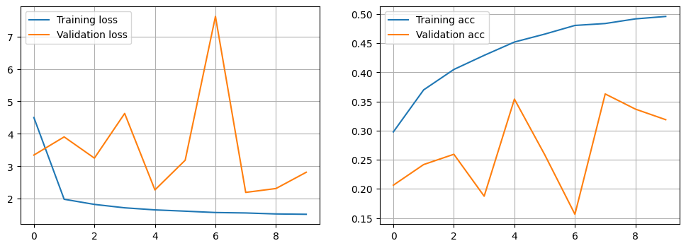
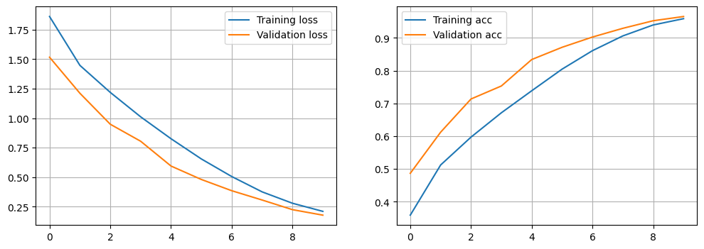

# Development Log

A development log note for keeping track of steps & milestones during development.

## 26-03-18

> Mauri

Setting up the file structure & baseline model code.

## 26-03-19

> Mauri

### Setting up basic CNN Structure

References:

- [keras image classification from scratch](https://keras.io/examples/vision/image_classification_from_scratch/)
- [tensorflow datasets guide](https://www.tensorflow.org/guide/data)
- [resize images in compvis - keras](https://keras.io/examples/vision/learnable_resizer/)

Dataset loading works a little bit different than with the CIFAR10 dataset, as we get tf.Dataset from loading this image data. But we can offload some of the work to available GPU devices that way, which feels necessary.

I added some initial image augmentation (horizontal mirroring and small random rotations) as well as image resizing to (64x64) as my laptop was not able to handle 224x224 image size (1 epoch with batchsize=64 would have taken about 15' - infeasible).

#### (FLAWED) First Model Setup & Training Run

- Image Size: resized to (64, 64)
- Epochs: 10
- Batchsize: 64
- Augmentations: Horizontal Image Mirroring, Random Rotations (<10%)

Model Architecture:

- Input Layer
- Rescaling Layer ([0, 255] -> [0, 1])
- Conv2D Layer (Kernels: 128, Kernel Size: (3, 3), Stride: (1, 1), Padding: 'same')
- Batch Normalisation Layer
- ReLU Activation Layer
- 2D Max Pooling Layer
- Flattening Layer
- FC / Dense Layer
- Softmax Activation Layer

Model Config:

- Optimiser: Adam
- Loss: Categorical Crossentropy

Training Time: 21min 33s (on Macbook Air)

Accuracy & Loss Plot:


Comments:

Something went seriously wrong here. I think the augmentations should not have been included in the first run. And 128 filters was probably a bit too much as well. I'll try another run without augmentations and with less filters...

> **BUG detected** -> data is not reliable as the training set has been accidentally assigned to the validation set

When resizing images, the dataset was wrongly assigned (see below).

```python
train_ds = train_ds.map(
    lambda X, y: (
        keras.preprocessing.image.smart_resize(
            X,
            size=target_image_size,
            interpolation=resizing_interpolation),
        y),
    num_parallel_calls=tf.data.AUTOTUNE,
)

# ! wrong assignment on line below
val_ds = train_ds.map(
    lambda X, y: (
        keras.preprocessing.image.smart_resize(
            X,
            size=target_image_size,
            interpolation=resizing_interpolation),
        y),
    num_parallel_calls=tf.data.AUTOTUNE,
)
```

Issue is now fixed and shouldnt interfere with next training run.

#### ~~Second~~ Actual First Model Setup & Training Run

- Image Size: resized to (64, 64)
- Epochs: 10
- Batchsize: 64
- Augmentations: **none**

Model Architecture:

- Input Layer
- Rescaling Layer ([0, 255] -> [0, 1])
- Conv2D Layer (Kernels: ~~128~~->**32**, Kernel Size: (3, 3), Stride: (1, 1), Padding: 'same')
- ~~Batch Normalisation Layer~~
- ReLU Activation Layer
- 2D Max Pooling Layer
- Flattening Layer
- FC / Dense Layer
- Softmax Activation Layer

Model Config:

- Optimiser: Adam
- Loss: Categorical Crossentropy

Training Time: 2min 24s (on Macbook Air)

Accuracy & Loss Plot:

Final Accuracy & Loss Values: `accuracy: 0.9588 - loss: 0.2105 - val_accuracy: 0.9654 - val_loss: 0.1784`

Comments:

Now this looks way more like it should.

## 26-03-21

> Joël

### Environment and general

- Added the tensorflow and matplotlib libraries to the requirements file
- Added the /env to git ignore to prevent pushing the local venv
- I use the Black Formatter, thus possible changes to layout were applied

### Additions to data preparation

To improve reproduceability, the random states were fixed:

- Models should now always produce the same output
- Data shuffling should always occur the same way
- Functions like ranom_flip will always flip the same way on consecutive runs
- etc.

To minimize class bias, a visualization of the class distribution was added. Findings: About uniform distribution

### Note on model performance

The model performance on the first run was significantly worse than on Mauri's runs.<br>
Reasons: Probably some dataset was overwritten due to nonsequential execution of notebook cells.<br>
→ But this is more what i excpected the model performance to look like on the validtion set and gives us room to improve. The model overfits and we need to improve on that.

Performance:

- Train acc: 0.95
- Validation acc: 0.43

### Added custom model builder

In order to play more easily with different model architectures, i created a model builder. See the testing code to learn how it works.<br>
With this, it will be easy to create differen model types and compare results.

Tried to add the F1 score but failed. Gave up on it and used the accuracy. Attempted:

- Built in keras f1 score -> only seems to work with binary classifiction
- keras_addon f 1 score -> there is a depency issue with python 3.12, meaning the library is deprecated
- Custom f1 score -> key to score does not show up in log.keys()

## 26-03-22

> Joël

### Text and notes

- Added some notes and explanations
- Some small changes of titels
- Added some structure and outlines for the further steps

### Model experimentation

Fixed a bug in the custom model builder class (forgot self, [classic mistake](https://youtu.be/nBWF7Nc97I0?t=15))

Over and underfitting:

- Built a underfitting model:
    - Simple model structure, fast training, but bad performance
    - Changed some params to proof the model is too simple (not enoough depth)
- Buitl a overfitting model:
    - Only built one model due to higher training times
    - Added the output as markdown and jpg to reduce runtime of notebook

A good model:

- tested different architectures and params
- found one that works well for further steps (see clf_2)
  Sure! Here it is:

Model Architecture for further steps:
| Layer (type) | Output Shape | Param # |
|---|---|---|
| rescaling (Rescaling) | (None, 64, 64, 3) | 0 |
| conv2d (Conv2D) | (None, 64, 64, 16) | 448 |
| conv2d (Conv2D) | (None, 64, 64, 16) | 2,320 |
| conv2d (Conv2D) | (None, 64, 64, 32) | 4,640 |
| conv2d (Conv2D) | (None, 64, 64, 32) | 9,248 |
| max_pooling2d (MaxPooling2D) | (None, 32, 32, 32) | 0 |
| conv2d (Conv2D) | (None, 32, 32, 32) | 9,248 |
| conv2d (Conv2D) | (None, 32, 32, 32) | 9,248 |
| conv2d (Conv2D) | (None, 32, 32, 64) | 18,496 |
| conv2d (Conv2D) | (None, 32, 32, 64) | 36,928 |
| max_pooling2d (MaxPooling2D) | (None, 16, 16, 64) | 0 |
| flatten (Flatten) | (None, 16384) | 0 |
| dense (Dense) | (None, 64) | 1,048,640 |
| dense (Dense) | (None, 32) | 2,080 |
| dense (Dense) | (None, 10) | 330 |

## 26-03-26

> Mauri

Continue with remaining mandatory tasks (optimisers, regularisation). Maybe additional data augmentation.

Endnote: mainly experimented with regularisation and parameters (somehow quite interesting). Will return tomorrow to work on optimisers and data augmentation.

## 26-03-27

> Mauri

Continue with optimiser experimentation. See notes in notebook.ipynb in optimizer chapter.

## 26-03-28

> Joël

Changes to existing code:

- Added the option for data augmentation layers to be added to the prototyping class
- Added the run_training param to most models so training can be easily turned off

Worked on optional objectives:

- Transfer learning:
    - Loaded the VVG16 Model
    - Made the last 2 layers trainable for fine tuning
    - Added a classification header with dropout and early stopping
    - Model training could not yet be completed due hardware constraints --> Must be run at a later time

- Data augmentation:
    - Added some data augmentation layers
    - Reloaded the data and retrained model (best arch, all regularizations used)

## 26-03-30

> Mauri

Goal: Data augmentation & further exerimentation

Changes:

- extended CLF class to use BatchNormalisation for convolution layers by default
- added additional data augmentation layers / updated parameters on existing ones

## 26-04-02

> Mauri

Today: Dataset enrichment + ~~Complex Model Training?~~

Some notes on Bing Search Query Params (-> no real documentation available, so i reverse engineer them).

image size:

- `+filterui:imagesize-small`
- `+filterui:imagesize-medium`
- `+filterui:imagesize-large`
- `+filterui:imagesize-wallpaper`
- `+filterui:imagesize-custom_WIDTH_HEIGHT` (custom minimum size)
  aspect ratio:
- `+filterui:aspect-square` (could be helpful)
  image type:
- `+filterui:photo-photo` (we dont want anything else here)

Which leads us to the following download command (for testing)

```bash
python image-groomer/image-scraper.py -v -s "cat" --limit 100 -o data/scraped/cat --filter "+filterui:imagesize-custom_224_224+filterui:photo-photo"
```

Once everything is clear, we can bulk download via search-terms file.

Beware, images need to be combed through to filter out unwanted images!! (Some images still contain graphics or tables even with photograph specified). Download ~10% more than what is needed in order to ensure target dataset size.

Categories:

- cat
- chicken
- cow
- dog
- elephant
- horse
- rabbit
- sheep
- squirrel
- zebra

Some parts of the script were not working properly or as intended. I'll fork the project and make a pull request with the fixes.

Issue: file-based image scraping limits downloads too eagerly

Problem:
When file-based image scraping mode is used, the download limit specified will apply _only to the first query_. For this query the scraper downloads `limit` amount of images. For every other query, the value of `limit` is not updated and will prevent images resulting from other queries to be downloaded.

Fix:
At the start of the image fetch function, initialise image_limit with zero

---

Issue: file-based image scraping query formulation includes linefeed

Problem:
When file-based image scraping mode is used, `inputFile.readlines()` will include a linefeed character (`\n`) for every query read from the file.

Fix:
Use `inputFile.read().splitlines()` instead, which returns a list of strings for each line in the file without linefeed character.

---

Issue: query parameters for Bing API are unclear

Problem:
Documentation currently lacks information about available query parameters and legal values, specifically for filtering query results.

Fix:
Extended documentation on query parameters and legal values.

---

Now i have downloaded around 300-400 images per class. These images still have to be worked through to ensure that they do actually contained what they should.

---

Concluding work. Dataset extension took a lot of time, no additional training done. Plotted some info about dataset and class distribution.


## 26-04-04

> Joël

Update to existing code:
- Added the option to execture training on GPU when possible
- Reworked the Chapters of Regulizer techniques with bigger architecture (L1, L2, Dropout)
- Other changes in regards to model sizes

Small Additions to existing code
- Added a new layer: Global average pooling
- Incresed image size to 96x96 due to more computing power

Newly added:
- clean up transfer learning
- Added a wandb experiment for hyperparamtuning for:
    - neurons on classification head
    - learning rate with adam optimizer
    - dropout rate

Comments:
- Edited all comments (md fields) for non optional objectives

### Next steps:
ToDo:
- Run all optional objectives
- Document findings
- Run all cells
- Clean up comments and md notes
- Create a fully exectued notebook (estimated runtime: 3 hours?)

## 2026-04-05

> Joël

- Some small changes and bug fixes
- Run the whole notebook and saved the outputs
- Created an html file for handin
